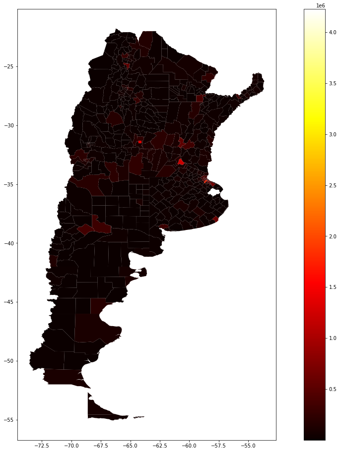
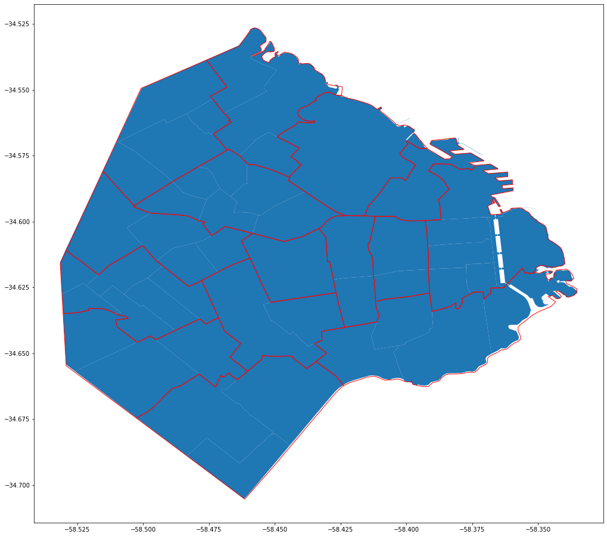
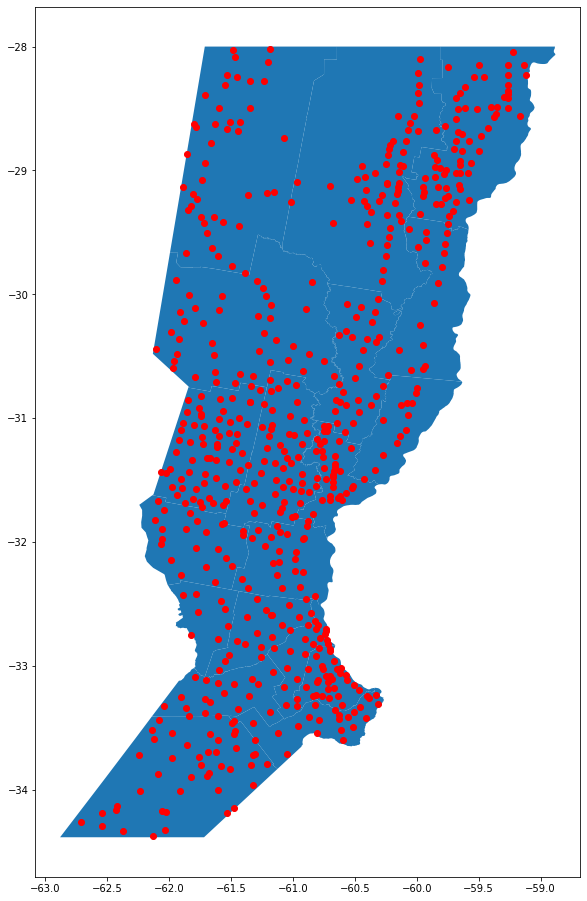

# arggeodir - ARGENTINA/SANTA FE/ROSARIO/ROSARIO/ME

Repositorio con información de Argentina organizada jerárquicamente:

- <code>maps_general.geojson</code>: geoshapes por jerarquía.
- <code>ingo_general.csv</code>: área, superficie, centroide por jerarquía.

<code>generator.py</code> genera los archivos basado en <code>./data_in/*.csv/geojson</code>  (área, superficie y geoshapes de Censo 2010).

## Idea repositorio

La idea original del repositorio fue organizar la información (como tablas de Wikipedia o geoshapes) de manera jerárquica e incluir toda la información en un archivo aprovechando el hecho que en las divisiones geográfica suele haber jerarquía de regiones.

Esto permite trabajar de manera natural con las regiones como si fueran estructuras de directorios que vemos a diario.

## Visualización de los datos


```python
import pandas as pd
import numpy as np
import os
import math
import geopandas as gpd
import unicodedata
import matplotlib.pyplot as plt


gdf = gpd.read_file('maps_general.geosjon')
gdf
```


<div>
<style scoped>
    .dataframe tbody tr th:only-of-type {
        vertical-align: middle;
    }

    .dataframe tbody tr th {
        vertical-align: top;
    }

    .dataframe thead th {
        text-align: right;
    }
</style>
<table border="1" class="dataframe">
  <thead>
    <tr style="text-align: right;">
      <th></th>
      <th>LOCATION</th>
      <th>geometry</th>
    </tr>
  </thead>
  <tbody>
    <tr>
      <th>0</th>
      <td>ARGENTINA</td>
      <td>MULTIPOLYGON (((-68.65412 -54.88624, -68.65414...</td>
    </tr>
    <tr>
      <th>1</th>
      <td>BOLIVIA</td>
      <td>MULTIPOLYGON (((-65.29247 -11.50472, -65.25756...</td>
    </tr>
    <tr>
      <th>2</th>
      <td>BRAZIL</td>
      <td>MULTIPOLYGON (((-48.54259 -27.81666, -48.55187...</td>
    </tr>
    <tr>
      <th>3</th>
      <td>CHILE</td>
      <td>MULTIPOLYGON (((-67.25609 -55.82887, -67.24511...</td>
    </tr>
    <tr>
      <th>4</th>
      <td>COLOMBIA</td>
      <td>MULTIPOLYGON (((-78.20489 2.68734, -78.18768 2...</td>
    </tr>
    <tr>
      <th>...</th>
      <td>...</td>
      <td>...</td>
    </tr>
    <tr>
      <th>1227</th>
      <td>ARGENTINA/SANTA FE/SAN MARTIN/WILDERMUTH</td>
      <td>POINT (-61.40008 -31.94343)</td>
    </tr>
    <tr>
      <th>1228</th>
      <td>ARGENTINA/SANTA FE/GENERAL OBLIGADO/YAGUARETE</td>
      <td>POINT (-59.26119 -28.30859)</td>
    </tr>
    <tr>
      <th>1229</th>
      <td>ARGENTINA/SANTA FE/LA CAPITAL/YAMANDU</td>
      <td>POINT (-60.66055 -31.39179)</td>
    </tr>
    <tr>
      <th>1230</th>
      <td>ARGENTINA/SANTA FE/ROSARIO/ZAVALLA</td>
      <td>POINT (-60.87988 -33.02167)</td>
    </tr>
    <tr>
      <th>1231</th>
      <td>ARGENTINA/SANTA FE/CASTELLANOS/ZENON PEREYRA</td>
      <td>POINT (-61.89560 -31.55985)</td>
    </tr>
  </tbody>
</table>
<p>1232 rows × 2 columns</p>
</div>


```python
df = pd.read_csv('info_general.csv')
df
```


<div>
<style scoped>
    .dataframe tbody tr th:only-of-type {
        vertical-align: middle;
    }

    .dataframe tbody tr th {
        vertical-align: top;
    }

    .dataframe thead th {
        text-align: right;
    }
</style>
<table border="1" class="dataframe">
  <thead>
    <tr style="text-align: right;">
      <th></th>
      <th>LOCATION</th>
      <th>LAT</th>
      <th>LONG</th>
      <th>POPULATION</th>
      <th>AREA</th>
    </tr>
  </thead>
  <tbody>
    <tr>
      <th>0</th>
      <td>ARGENTINA</td>
      <td>-35.387551</td>
      <td>-65.178191</td>
      <td>45119153.0</td>
      <td>2780400.0</td>
    </tr>
    <tr>
      <th>1</th>
      <td>BOLIVIA</td>
      <td>-16.706877</td>
      <td>-64.684754</td>
      <td>11642688.0</td>
      <td>1098581.0</td>
    </tr>
    <tr>
      <th>2</th>
      <td>BRAZIL</td>
      <td>-10.780859</td>
      <td>-53.092482</td>
      <td>212322269.0</td>
      <td>8514877.0</td>
    </tr>
    <tr>
      <th>3</th>
      <td>CHILE</td>
      <td>-37.743606</td>
      <td>-71.364374</td>
      <td>19132249.0</td>
      <td>756102.0</td>
    </tr>
    <tr>
      <th>4</th>
      <td>COLOMBIA</td>
      <td>3.909413</td>
      <td>-73.083842</td>
      <td>50888825.0</td>
      <td>1138910.0</td>
    </tr>
    <tr>
      <th>...</th>
      <td>...</td>
      <td>...</td>
      <td>...</td>
      <td>...</td>
      <td>...</td>
    </tr>
    <tr>
      <th>1228</th>
      <td>ARGENTINA/SANTA FE/SAN MARTIN/WILDERMUTH</td>
      <td>-31.943435</td>
      <td>-61.400080</td>
      <td>NaN</td>
      <td>NaN</td>
    </tr>
    <tr>
      <th>1229</th>
      <td>ARGENTINA/SANTA FE/GENERAL OBLIGADO/YAGUARETE</td>
      <td>-28.308587</td>
      <td>-59.261189</td>
      <td>NaN</td>
      <td>NaN</td>
    </tr>
    <tr>
      <th>1230</th>
      <td>ARGENTINA/SANTA FE/LA CAPITAL/YAMANDU</td>
      <td>-31.391789</td>
      <td>-60.660547</td>
      <td>NaN</td>
      <td>NaN</td>
    </tr>
    <tr>
      <th>1231</th>
      <td>ARGENTINA/SANTA FE/ROSARIO/ZAVALLA</td>
      <td>-33.021672</td>
      <td>-60.879881</td>
      <td>4966.0</td>
      <td>NaN</td>
    </tr>
    <tr>
      <th>1232</th>
      <td>ARGENTINA/SANTA FE/CASTELLANOS/ZENON PEREYRA</td>
      <td>-31.559847</td>
      <td>-61.895602</td>
      <td>1637.0</td>
      <td>NaN</td>
    </tr>
  </tbody>
</table>
<p>1233 rows × 5 columns</p>
</div>


## Ejemplos de uso

### Provincias con centroides


```python
prov_arg = gdf[gdf['LOCATION'].apply(lambda l : l.startswith('ARGENTINA') and l.count('/')==1)]

fig, ax = plt.subplots(figsize = (20,16)) 
prov_arg.plot(ax=ax)
prov_arg['geometry'].centroid.plot(ax=ax,color='r')
```


    <matplotlib.axes._subplots.AxesSubplot at 0x7fd4da70d750>


### Departamentos color por población


```python
deps_arg = gdf[gdf['LOCATION'].apply(lambda l : l.startswith('ARGENTINA') and l.count('/')==2)]
df_info = df.reset_index()
deps_arg_info = df_info[df_info['LOCATION'].apply(lambda l : l.startswith('ARGENTINA') and l.count('/')==2)]
deps_arg = pd.merge(deps_arg,deps_arg_info,on='LOCATION',how='left')

fig, ax = plt.subplots(figsize = (20,16)) 
deps_arg.plot(ax=ax,column='POPULATION', cmap='hot', legend=True)
```


    <matplotlib.axes._subplots.AxesSubplot at 0x7fd4dc340b50>





### Barrios CABA y respectiva comuna


```python
barrios_caba = gdf[gdf['LOCATION'].apply(lambda l : l.startswith('ARGENTINA/CABA/') and l.count('/')==3)]
comunas_caba = gdf[gdf['LOCATION'].apply(lambda l : l.startswith('ARGENTINA/CABA/') and l.count('/')==2)]

fig, ax = plt.subplots(figsize = (20,16)) 

barrios_caba.plot(ax=ax)
comunas_caba.plot(ax=ax,color='none',edgecolor='r')
```


    <matplotlib.axes._subplots.AxesSubplot at 0x7fd4da575610>





### Ciudades Santa Fe


```python
ciudades_sf = gdf[gdf['LOCATION'].apply(lambda l : l.startswith('ARGENTINA/SANTA FE') and l.count('/')==3)]
departamentos_sf = gdf[gdf['LOCATION'].apply(lambda l : l.startswith('ARGENTINA/SANTA FE') and l.count('/')==2)]

fig, ax = plt.subplots(figsize = (15,16)) 
departamentos_sf.plot(ax=ax)
ciudades_sf.plot(ax=ax,color='r')
```


    <matplotlib.axes._subplots.AxesSubplot at 0x7fd4da1256d0>





## Autores
- Mariano Crosetti | Computer Sciences student @ [Facebook](https://www.facebook.com/mariano.crosetti.3) | [LinkedIn](https://www.linkedin.com/in/mariano-crosetti-0b71a4146/) | [Twitter](https://twitter.com/MarianoCrosetti) | [Github](https://github.com/mariano22/)

